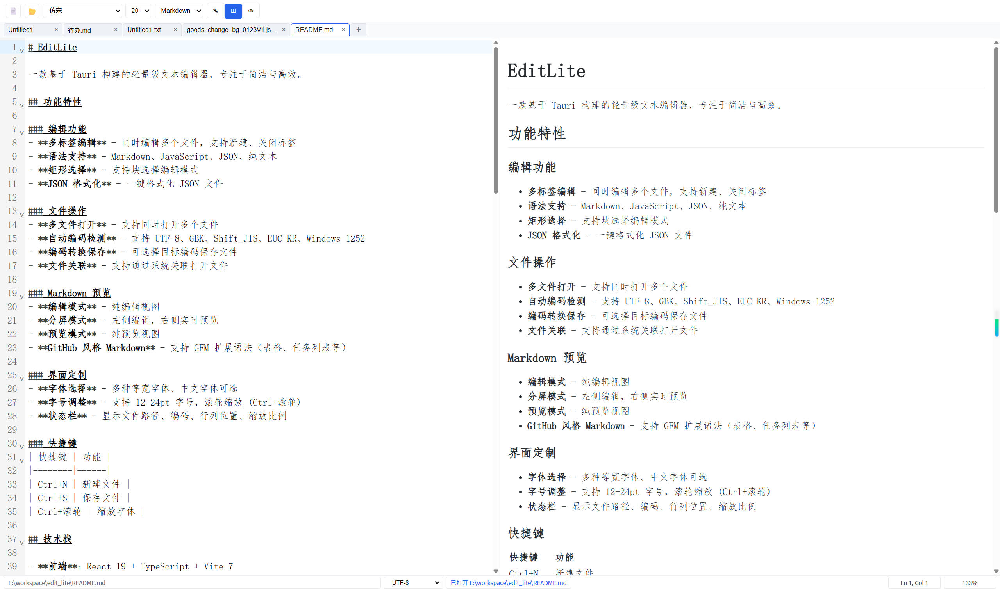

# EditLite

  <!-- 如果发包 -->


A lightweight text editor built on Tauri, focusing on simplicity and efficiency.
一款基于 Tauri 构建的轻量级文本编辑器，专注于简洁与高效。

**[English](./README_en.md)** | 中文


## 功能特性

### 编辑功能
- **多标签编辑** - 同时编辑多个文件，支持新建、关闭标签
- **语法支持** - Markdown、JavaScript/TypeScript、JSON、CSS、HTML、Python、SQL、Java
- **矩形选择** - 支持块选择编辑模式
- **自动换行** - 支持开关自动换行功能
- **JSON 格式化** - 一键格式化 JSON 文件

### 文件操作
- **多文件打开** - 支持同时打开多个文件
- **自动编码检测** - 支持 UTF-8、GBK、Shift_JIS、EUC-KR、Windows-1252
- **编码转换保存** - 可选择目标编码保存文件
- **文件关联** - 支持通过系统关联打开文件
- **文件变动提醒** - 支持文件变动提醒，避免丢失未保存的修改
- **窗口自动激活** - 最小化状态下双击文件可自动恢复窗口并激活
### Markdown 预览
- **编辑模式** - 纯编辑视图
- **分屏模式** - 左侧编辑，右侧实时预览
- **预览模式** - 纯预览视图
- **GitHub 风格 Markdown** - 支持 GFM 扩展语法（表格、任务列表等）
- **增强预览模式** - 支持算法可视化等交互式组件

### 增强型预览（算法可视化）

EditLite 内置了算法可视化功能，无需安装插件。在 Markdown 中使用特殊指令即可展示动态算法演示。

#### 使用方法

1. 在 Markdown 文件中输入指令语法
2. 切换到**分屏**或**预览**模式
3. 点击预览区上方的 **"增强"** 按钮激活增强预览
4. 使用控制按钮操作动画

#### 内置组件

##### 排序可视化指令

```markdown
:sort{array=[64, 34, 25, 12, 22, 11, 90], algorithm="bubble", speed=400}
```

##### 参数说明

| 参数 | 类型 | 说明 | 默认值 |
|------|------|------|--------|
| `array` | `[number]` | 要排序的数字数组 | `[5, 2, 8, 1, 9]` |
| `algorithm` | string | 算法类型 | `bubble` |
| `speed` | number | 动画速度（毫秒） | `300` |
| `showSteps` | boolean | 是否显示步骤描述 | `true` |

##### 支持的排序算法

| 算法 | 说明 |
|------|------|
| `bubble` | 冒泡排序 |
| `quick` | 快速排序 |
| `merge` | 归并排序 |
| `insertion` | 插入排序 |
| `selection` | 选择排序 |

#### 外部插件系统

EditLite 支持用户开发自定义插件，放置在插件目录中，无需重新打包应用。

**示例插件：计数器**

```markdown
:counter{initialValue=10, step=5, min=0, max=100}
```

详细开发指南请参阅 [开发使用手册](./DEVELOPMENT.md)。

#### 完整示例

```markdown
# 排序算法演示

## 冒泡排序
:sort{array=[64, 34, 25, 12, 22, 11, 90], algorithm="bubble", speed=400}

## 快速排序
:sort{array=[9, 7, 5, 11, 12, 2, 14, 3], algorithm="quick", speed=300}
```

### 界面定制
- **主题切换** - 支持系统主题、亮色主题、暗色主题三种模式
- **字体选择** - 多种等宽字体、中文字体可选
- **字号调整** - 支持 12-24pt 字号，滚轮缩放 (Ctrl+滚轮)
- **状态栏** - 显示文件路径、编码、行列位置、缩放比例

### 快捷键
| 快捷键 | 功能 |
|--------|------|
| Ctrl+N | 新建文件 |
| Ctrl+S | 保存文件 |
| Ctrl+W | 关闭当前标签页 |
| Ctrl++ | 放大字体 |
| Ctrl+- | 缩小字体 |
| Ctrl+滚轮 | 缩放字体 |

## 技术栈

- **前端**: React 19 + TypeScript + Vite 7
- **后端**: Tauri 2 + Rust
- **编辑器**: CodeMirror 6
- **Markdown**: react-markdown + remark-gfm
- **可视化**: 自定义算法动画组件（按需懒加载）

## 开发

### 环境要求

- Node.js 18+
- Rust 1.70+
- pnpm / npm / yarn

### 安装依赖

```bash
npm install
```

### 开发模式

```bash
npm run tauri dev
```

### 构建发布

```bash
npm run tauri build
```

生成的安装包位于 `src-tauri/target/release/bundle/` 目录。

## 项目结构

```
edit_lite/
├── src/                          # 前端源码
│   ├── App.tsx                   # 主应用组件
│   ├── App.css                   # 样式文件
│   ├── main.tsx                  # 入口文件
│   ├── core/types/               # 类型定义
│   │   └── directive.ts          # 指令类型
│   ├── plugins/                  # 插件系统
│   │   ├── remark-directive-custom.ts  # 指令解析插件
│   │   └── component-registry.ts       # 组件注册表
│   ├── components/               # UI 组件
│   │   ├── PreviewEngine/        # 双模式预览引擎
│   │   ├── ExternalPluginLoader/ # 外部插件加载器
│   │   └── PluginSandbox/        # 插件沙箱
│   └── visualizers/              # 可视化组件
│       └── algorithms/           # 算法可视化
│           └── SortVisualizer.tsx
├── plugins/                      # 外部插件目录
│   └── example-counter/          # 计数器示例插件
│       ├── plugin.json           # 插件配置
│       └── index.html            # 插件实现
├── src-tauri/                    # Tauri 后端
│   ├── src/
│   │   ├── main.rs               # 入口
│   │   └── lib.rs                # 核心逻辑
│   ├── Cargo.toml                # Rust 依赖
│   └── tauri.conf.json           # Tauri 配置
├── package.json
└── README.md
```

## 支持的文件类型

| 扩展名 | 说明 |
|--------|------|
| .txt | 纯文本 |
| .md | Markdown |
| .js | JavaScript |
| .ts | TypeScript |
| .json | JSON |
| .html | HTML |
| .css | CSS |
| .rs | Rust |
| .py | Python |

## 开发计划

- [x] 支持 Markdown 语法
- [x] 支持 JavaScript 语法
- [x] 支持 JSON 语法
- [x] 支持矩形选择
- [x] 自定义字体设置
- [x] 查找替换功能
- [x] 深色主题
- [x] 支持更多语法高亮
- [x] 增强型预览引擎（双模式）
- [x] 排序算法可视化
- [ ] 查找算法可视化
- [ ] 图论算法可视化
- [ ] LaTeX 公式支持
- [ ] 3D 地球可视化
- [ ] 自动保存


## 许可证

MIT License

---

## 更多文档

- [开发使用手册](./DEVELOPMENT.md) - 增强型预览功能的详细使用指南和开发文档
